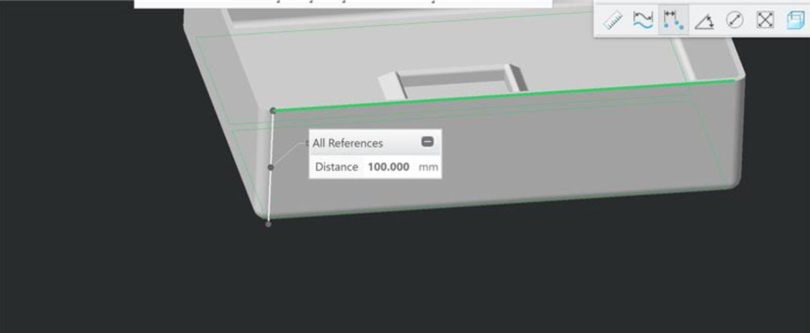
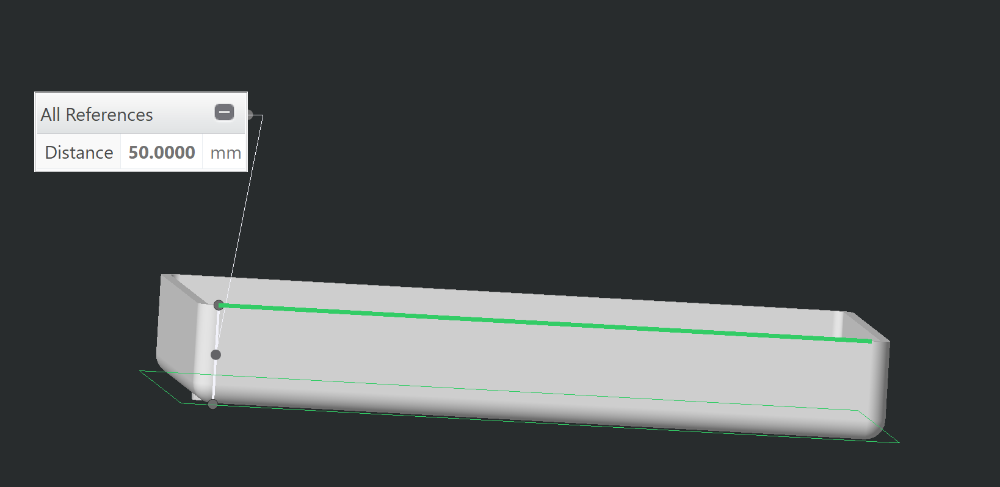

Design of Experiment
====================

The following report describes the procedure adopted to determine the optimal sizes of the table and the drawer.
The procedure consisted of the following steps:
1. [**Identifying a nominal target pose**](#1-identifying-a-nominal-target-pose)
    - We selected the left arm and identified a _nominal target pose_, to be reached both in position and orientation with low errors and with a joint configuration fairly away from the bounds. The nominal value for the y-axis is 0, whereas the nominal orientation is parallel to the table;
1. [**Sensitivity analysis**](#2-sensitivity-analysis)
    - We performed a sensitivity analysis by _perturbing the nominal pose in position_ using a uniform sampling method;
1. [**Optimizing table and drawer dimensions**](#3-optimizing-table-and-drawer-dimensions)
    - We optimized for the table relative position with respect to the robot, its dimensions as well as the dimensions of the drawer. The quantity we aim to optimize for was the distance between the top-center of the cube and our target pose;
1. [**Selecting a pick/drop pose**](#4-selecting-a-pick-and-drop-pose)
    - We additionally seeked for a suitable second location next to the drawer where iCub can pick/drop the cube.

**Important note**: we simulated **reaching actions** and not grasping, as this is _task dependent_.
Moreover, executing robust grasping actions with iCub models in `Gazebo` is not supported at the moment, but is a current work in progress.

## 1. Identifying a nominal target pose

The **nominal target pose** was selected such that:
- the **error in position**, computed this as Euclidean distance between desired and reached target, is **below `1cm`**;
- the **error in orientation**, computed this as $\arcsin \theta$, where $\theta$ is the angle between desired and reached orientation, is **below `15 degrees`**;
- the **joint configuration**, evaluated as distance between each joint (of left arm and torso) and their lower and upper limits, is **higher than `5.0 degrees`**.

The analysis was performed by selecting a bunch of targets to reach and evaluating the aforementioned errors.
The following table summarizes the results for different targets (averaged over 3 repetitions).

|  Target                            |  error   position [cm] |  error   orientation [deg]  | Shoulder    [deg]           |   Elbow   [deg] | Wrist   [deg]  |  Torso   [deg] |  
|  ------                            |  -------------|  -------   | ----------              |   -------- |  ------- | -------- |  
|  Target 1:   xd = -0.6 0.0 -0.1   ori = 0.0 0.0 1.0 3.14   |       **9**    |     **53.1**    |  pitch = [**0.1** 105.0]   roll = [54.2 105.8]   yaw = [51.6 65.4]   | [26.8 64.2] |  prosup = [110.6 9.4]   pitch = [62.1 42.9]   yaw = [24.4 20.6] | yaw = [99.8 **0.2**]   roll = [29.9 30.1]   pitch = [69.1 21.0]           |
|  Target 2:  xd = -0.5 0.0 -0.1   ori = 0.0 0.0 1.0 3.14   |      0.6    |     4.0    |  pitch = [**0.3** 105.3]   roll = [62.9 97.1]   yaw = [93.8 23.2]   | [17.9 73.1] |  prosup = [120.0 **0.05**]   pitch = [65.1 40.0]   yaw = [38.9 **6.1**] | yaw = [99.9 **0.1**]   roll = [29.9 30.1]   pitch = [64.1 25.9]           |
|  Target 3:  xd = -0.4 0.0 -0.1   ori = 0.0 0.0 1.0 3.14   |       0.6    |     2.9    |  pitch = [25.2 79.7]   roll = [24.8 135.2]   yaw = [87.4 29.6]   | [**0.2** 90.8] |  prosup = [120.0 **0.03**]   pitch = [46.1 59.0]   yaw = [45.0 **0.0**] | yaw = [74.1 25.9]   roll = [29.8 30.2]   pitch = [50.6 39.4]           |  
|  Target 4:  xd = -0.4 0.0 0.0   ori = 0.0 0.0 1.0 3.14    |       0.2    |     2.9    |  pitch = [30.0 75.0]   roll = [24.7 135.3]   yaw = [84.4 32.6]   | [**8.4** 82.5] |  prosup = [115.7 **4.2**]   pitch = [63.6 41.4]   yaw = [45.0 **0.0**] | yaw = [73.1 26.8]   roll = [29.8 30.2]   pitch = [33.2 56.8]           |  
|  Target 5:  xd = -0.3 0.0 -0.1   ori = 0.0 0.0 1.0 3.14   |       0.6    |     11.5    |  pitch = [59.6 45.4]   roll = [23.3 136.7]   yaw = [115.2 **1.8**]   | [**4.8** 86.2] |  prosup = [72.1 47.9]   pitch = [29.1 75.9]   yaw = [45.0 **0.0**] | yaw = [81/7 18.3]   roll = [29.8 30.1]   pitch = [25.5 6457]           |  
|  Target 6:  xd = -0.35 0.0 -0.1   ori = 0.0 0.0 1.0 3.14   |       0.7    |     5.2    |  pitch = [45.5 59.5]   roll = [24.9 135.0]   yaw = [90.2 26.8]   | [**0.1** 90.9] |  prosup = [105.3 14.7]   pitch = [37.9 67.0]   yaw = [45.0 **0.0**] | yaw = [78.4 21.6]   roll = [29.8 30.2]   pitch = [37.4 52.6]           |  
|  Target 7:  xd = -0.35 0.0 0.0   ori = 0.0 0.0 1.0 3.14   |       0.2    |     5.7    |  pitch = [50.2 54.7]   roll = [24.5 135.4]   yaw = [86.0 31.0]   | [16.4 74.6] |  prosup = [104.6 15.4]   pitch = [61.2 43.7]   yaw = [45.0 **0.0**] | yaw = [74.0 26.0]   roll = [29.8 30.2]   pitch = [19.6 70.4]           |
|  Target 8:  xd = -0.35 0.0 -0.05   ori = 0.0 0.0 1.0 3.14    |       0.2    |     5.7    |  pitch = [48.8 56.2]   roll = [24.5 135.5]   yaw = [90.7 26.2]   | [6.7 84.3] |  prosup = [101.4 18.6]   pitch = [47.9 57.1]   yaw = [45.0 **0.0**] | yaw = [76.9 23.1]   roll = [29.9 30.0]   pitch = [27.0 62.9]           |  
|  Target 9:  xd = -0.2 0.0 -0.1   ori = 0.0 0.0 1.0 3.14    |       0.6    |     **30.0**    |  pitch = [79.0 26.0]   roll = [23.7 136.3]   yaw = [113.9 **3.2**]   | [40.2 50.8] |  prosup = [86.7 33.3]   pitch = [31.3 73.6]   yaw = [45.0 **0.0**] | yaw = [68.0 32.0]   roll = [29.9 30.0]   pitch = [19.6 70.4]           |  

Results exceeding the thresholds (and thus bad targets) are highlighted, specifically with:
- errors in position higher than `1 cm`;
- errors in orientation higher than `15 degrees`;
- joints distances from their upper and lower limits lower than `10 degrees`.

Overall, targets from 2 to 8 are reached with low errors in position and orientation, but specifically **targets 4, 7, 8**  provide fairly low errors in position (below `0.5 cm`). Furthermore, **target 7, 8** are reached with a joint configuration that better fits the limits.
Regarding the other targets, we can notice that:

- _target 1_ is not reached at all, as both errors in position and orientation are higher than the thresholds. Furthermore, the shoulder pitch and the torso yaw reach the lower and the upper limit respectively. This is an indication that the target is too far from the robot;
- _target 2_ is reached with low errors in position and orientation, but shoulder pitch and the torso yaw are still close to the limits, indicating that the target is again far from the robot;
- _target 3, 5 and 6_ are reached with low errors in position and orientation, but the elbow is very close to its lower bound;
- _target 9_ has a high error on the orientation. Furthermore, the shoulder yaw reaches the upper limit. These are both indications that the target is too close to the robot.

**Target 7 and 8** are the most reasonable candidates as nominal poses. To accommodate for a reasonable table height, we chose **target 8** which is `5 cm` lower than target 7.

The following are the errors in position and orientation and the joint configuration over the three repetitions for **target 8**.

| error position [cm] | error orientation [deg] |
|--- |--- |
| |  |
| _Legend_:   _blue: error_   _magenta: threshold_  |

| Joint configuration |
| --- |
|  |
| _Legend_:   _black: dist from lower limit_   _red: dist from upper limit_   _magenta: threshold_  |

The errors in position and orientation are fairy below the thresholds, along with a reasonable joint configuration (joints are fairly away from their bounds).

Finally, **the nominal target pose we selected is `(-0.35 0.0 -0.05 0.0 0.0 1.0 3.14159)`**.

## 2. Sensitivity analysis

### 2.1 Sampling the nominal pose

Given the nominal pose we chose `(-0.35 0.0 -0.05 0.0 0.0 1.0 3.14159)` following the analysis in #10, we perturbed its position sampling it with a uniform method within the three following ranges:
- along the x direction: `[-5 5] cm`;
- along the y direction: `[-3 3] cm`;
- along the z direction: `[-1 1] cm`.

We selected `100` poses around the nominal pose with the afore-mentioned method and evaluated the **error** in _position_ and _orientation_ between the reached and the desired target and the **joint configuration**.

### 2.2 Evaluating errors in position and orientation

The following shows the errors in position and orientation for the sampled poses:

| error position [cm] | error orientation [deg] |
| ------------- | ------------- |  
| 
  
 | 
  
 |
| _Legend_:   _blue: error_   _magenta: threshold: `1 cm`_ | _Legend_:   _blue: error_   _magenta: threshold: `15 deg`_  |

The reported errors have the following values:
- **error in position**: `0.43 +/- 0.33 cm`, with a percentage of samples _above the threshold_ (set at `1 cm`) of `11%`;
- **error in orientation**: `7.01 +/- 4.08 deg`, with a percentage of samples _above the threshold_ (set at `15 deg`) of `4%`.

The two percentages are comparable and fairly low, indicating that we can achieve a good reachability in position and orientation.
Therefore the sensitivity analysis shows that the area around the nominal pose within `[-5 5] cm` along `x`, `[-3 3] cm` along `y` and `[-1 1] cm` along `z`, can be covered with a reachability of `0.43 +/- 0.33 cm` in position and `7.01 +/- 4.08 deg` in orientation, which are reasonable values when considering the _reaching task_. Importantly, the chosen thresholds can be adjusted depending on the specific task to perform.

We further analyzed the errors to investigate the poses providing higher errors.
The following plots show the poses around the nominal one sampled within the ranges `x` and `y` (the center represents the nominal pose where the icub hand is drawn not in scale), with the colors quantifying the errors in position and orientation respectively.  

| error position [cm] | error orientation [deg] |
| ------------- | ------------- |  
| 
  
 | 
  
 |
| _Legend_:   _blue: `0 cm`_   _yellow: `2 cm`_  | _Legend_:   _blue: `0 deg`_   _yellow: `20 deg`_ |

The plots show that:
- the **error in position** stays consistently below `1cm`, with a _slight_ increase in the **top area** (cyan dots), corresponding to poses further from the robot;
- the **error in orientation** presents a **bottom right area** with higher values, corresponding to poses closer to the robot and to the right of the nominal pose. This is expected as the left arm is used for performing the analysis and, importantly, the **right arm** can be used to cover this area.    

### 2.3 Evaluating the joint configuration

The following shows the distances of each joint from its lower and upper limit for the sampled poses:

| Joint configuration |
| --- |
|  |
| _Legend_:   _black: dist from lower limit_   _red: dist from upper limit_   _magenta: threshold: `5 deg`_  |

The joints are fairly distant from their limits (black and red histograms are higher than the threshold), except the **wrist yaw** and the **elbow** :
- the **wrist yaw** is always close to its higher limit, which is reasonable to achieve the desired orientation;
- the **elbow** is close to the lower limit when trying to reach poses on the right of the nominal one, as visible here (it's below the threshold in the right area):

 
  

Again, for this area the **right arm** can be used.

### 2.4 Final remarks

The sensitivity analysis shows that:
- __the area around the nominal pose within `[-5 5] cm` along `x`, `[-3 3] cm` along `y` and `[-1 1] cm` along `z`, can be covered with a reachability of `0.43 +/- 0.33 cm` in position and `7.01 +/- 4.08 deg` in orientation__;
- such area is reached with a __reasonable joint configuration__;
- the sub-area on the right of the nominal pose is reached with __higher error in orientation and the elbow configuration close to its lower limit__. This can be addressed by resorting to the __right arm__ to cover the area.

## 3. Optimizing table and drawer dimensions
The dimensions of the table has been designed in close loop with MWS for allowing a comfortable grasp pose from the iCub standpoint.

### 3.1 Drawer
The height of the drawer has been reduced from `10 cm` to `5 cm` in order to facilitate the grasping of the cube.

| Before | After |
| :---: | :---: |
|  |  |

### 3.2 Table
Since the nominal target pose we selected is `(-0.35 0.0 -0.05 0.0 0.0 1.0 3.14159)`, we changed the table dimensions in order to have the center of the top face of the cube at `(-0.35 0.0 -0.05)` with respect to the [root of iCub](http://wiki.icub.org/wiki/ICubForwardKinematics).

We achieved that by reducing the table dimensions and the height of the pole of iCub stand.

Here is some measures taken from the final CAD drawings:

| |
| :---: |
| **Depth of the table** |
| 

 |
| **Height of iCub root frame** |
| 

 |
| **Height of cube top face** |
| 

 |
| **Resulting transformation cube->root** |
| 

 |

## 4. Selecting a pick and drop pose

Finally, we selected a second location next to the drawer where iCub can pick/drop the cube.
The pose selected is `-0.3 -0.3 -0.05 0.0 0.0 1.0 3.49066`, as it produced the following output:

